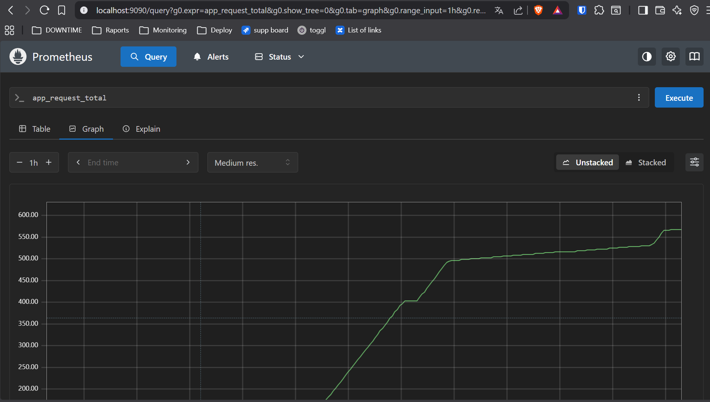
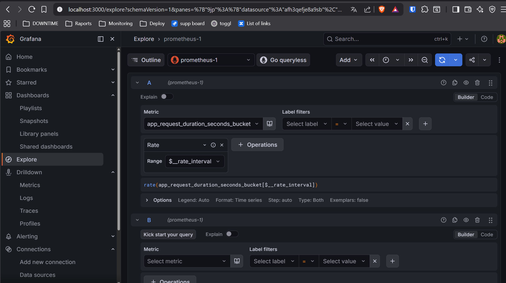

# 🚀 Async Task Platform
 
Async Task Platform is a containerized backend system for processing background jobs using **FastAPI + Celery + Redis + PostgreSQL**, with integrated **Prometheus monitoring and Grafana dashboards**.
 
The project demonstrates a production-style architecture for asynchronous task execution with observability support.
 
---
 
## 🧠 Project Overview
 
The system allows users to:
 
- submit asynchronous tasks via REST API
- process tasks in background workers
- track task execution status in real time
- store results in PostgreSQL
- monitor API performance using Prometheus
- visualize metrics in Grafana
 
This project simulates a simplified distributed job-processing backend similar to real-world task processing systems.
 
---
 
## 🖥️ Dashboard
 
The platform includes a built-in web dashboard available at `http://localhost:8000`.
 

 
### Dashboard features
 
**Stats Bar** — four live counters at the top of the page, updated automatically every 2 seconds:
- `TOTAL` — total number of submitted tasks
- `PENDING` — tasks waiting to be picked up by a worker
- `RUNNING` — tasks currently being processed
- `SUCCESS` — tasks completed successfully
 
**Submit Panel** — type any payload into the input field and press `Submit →` or hit `Enter`. The task is immediately registered in the database and queued for processing. An inline toast confirms the submission or shows an error.
 
**Task Queue** — live table showing all tasks sorted newest-first with four columns: Task ID, Payload, Status badge, and Result. Status badges are color-coded:
- 🟡 `PENDING` — queued, not yet started
- 🔵 `STARTED` — worker is processing
- 🟢 `SUCCESS` — completed with result
- 🔴 `FAILURE` — processing failed
 
**Footer links** — quick access to Prometheus, Grafana, and the FastAPI interactive docs (`/docs`).
 
---
 
## 🏗️ Architecture
 
```
Client (Browser)
       |
       v
  FastAPI :8000
  ├── REST API  (/task, /tasks, /metrics)
  └── Static frontend (index.html)
       |
       ├──► PostgreSQL :5432  (task metadata storage via SQLAlchemy)
       |
       └──► Redis :6379  (message broker)
                 |
                 v
          Celery Worker
          (background job processing)
 
  Prometheus :9090 ──scrapes /metrics──► FastAPI
       |
       v
  Grafana :3000
```
 
---
 
## ⚙️ Tech Stack
 
| Layer | Technology |
|---|---|
| API | FastAPI + Uvicorn |
| Task queue | Celery |
| Message broker | Redis |
| Database | PostgreSQL |
| ORM | SQLAlchemy |
| Monitoring | Prometheus |
| Visualization | Grafana |
| Infrastructure | Docker + Docker Compose |
 
---
 
## 🔄 Task Lifecycle
 
Every task goes through the following states:
 
```
POST /task
   ↓
task stored in PostgreSQL  →  status: PENDING
   ↓
Celery worker picks up job via Redis
   ↓
worker updates status  →  STARTED
   ↓
task processed (simulated work)
   ↓
status updated  →  SUCCESS
   ↓
result stored in database
```
 
---
 
## 📦 Project Structure
 
```
async-task-platform
│
├── app
│   ├── main.py          # FastAPI app, endpoints, middleware
│   ├── database.py      # SQLAlchemy engine and session
│   ├── models.py        # Task model definition
│   └── tasks.py         # Celery task definitions
│
├── docker
│   └── Dockerfile
│
├── docs
│   ├── Dashboard .png
│   ├── prometheus3.png
│   └── grafana3.png
│
├── frontend
│   └── index.html       # Web dashboard
│
├── monitoring
│   └── prometheus.yml   # Prometheus scrape config
│
├── docker-compose.yml
└── requirements.txt
```
 
---
 
## 🚀 Quick Start
 
**Clone the repository:**
 
```bash
git clone https://github.com/karolkuzniak/async-task-platform.git
cd async-task-platform
```
 
**Start all services:**
 
```bash
docker compose up --build
```
 
All 6 containers will start automatically: `api`, `worker`, `postgres`, `redis`, `prometheus`, `grafana`.
 
---
 
## 🌐 Available Services
 
| Service | URL | Description |
|---|---|---|
| Dashboard | http://localhost:8000 | Web UI for submitting and tracking tasks |
| API Docs | http://localhost:8000/docs | Interactive Swagger documentation |
| Prometheus | http://localhost:9090 | Metrics explorer |
| Grafana | http://localhost:3000 | Metrics visualization |
 
**Grafana default credentials:**
```
login:    admin
password: admin
```
 
> **Note:** When adding Prometheus as a data source in Grafana, use `http://prometheus:9090` — not `localhost:9090`. Docker containers communicate using service names, not localhost.
 
---
 
## 🔌 API Endpoints
 
### `POST /task` — Create a task
 
```bash
curl -X POST http://localhost:8000/task \
  -H "Content-Type: application/json" \
  -d '{"data": "process_report_2024"}'
```
 
Response:
```json
{
  "task_id": "3b15ab3d-7d15-4d5e-bfaf-a0a4ca5ba..."
}
```
 
### `GET /task/{task_id}` — Get task status
 
```bash
curl http://localhost:8000/task/3b15ab3d-7d15-4d5e-bfaf-a0a4ca5ba...
```
 
Response:
```json
{
  "id": "3b15ab3d-...",
  "status": "SUCCESS",
  "result": "Processed: process_report_2024",
  "data": "process_report_2024"
}
```
 
### `GET /tasks` — List all tasks
 
```bash
curl http://localhost:8000/tasks
```
 
### `GET /metrics` — Prometheus metrics endpoint
 
Exposes `app_request_total` and `app_request_duration_seconds` consumed by Prometheus.
 
---
 
## 📊 Monitoring
 
### Prometheus
 
Prometheus scrapes the `/metrics` endpoint every 15 seconds and collects:
- `app_request_total` — total number of HTTP requests
- `app_request_duration_seconds` — request duration histogram
 

 
To query metrics open `http://localhost:9090` and run:
```
app_request_total
rate(app_request_duration_seconds_bucket[$__rate_interval])
```
 
### Grafana
 
Grafana connects to Prometheus as a data source and allows building dashboards to visualize API latency, request throughput, and system performance trends.
 

 
To connect Grafana to Prometheus:
1. Go to `http://localhost:3000` → **Connections → Data sources**
2. Add **Prometheus**
3. Set URL to `http://prometheus:9090`
4. Click **Save & Test**
 
---
 
## 🐳 Docker Services
 
| Container | Image | Role |
|---|---|---|
| `api` | custom (Python 3.11) | FastAPI REST API + static frontend |
| `worker` | custom (Python 3.11) | Celery background worker |
| `db` | postgres:15 | Task metadata storage |
| `redis` | redis:7 | Message broker for Celery |
| `prometheus` | prom/prometheus | Metrics collection |
| `grafana` | grafana/grafana | Metrics visualization |
 
---
 
## 🧪 Example Task Execution
 
Submit several tasks quickly to see mixed statuses in the dashboard:
 
```bash
curl -X POST http://localhost:8000/task -H "Content-Type: application/json" -d '{"data":"generate_invoice"}'
curl -X POST http://localhost:8000/task -H "Content-Type: application/json" -d '{"data":"send_welcome_email"}'
curl -X POST http://localhost:8000/task -H "Content-Type: application/json" -d '{"data":"process_payment"}'
curl -X POST http://localhost:8000/task -H "Content-Type: application/json" -d '{"data":"export_csv_report"}'
```
 
Tasks will transition through `PENDING → STARTED → SUCCESS` with a ~5 second processing delay per task (configurable in `app/tasks.py`).
 
---
 
## 📌 Project demonstrates
 
- Async backend architecture with FastAPI
- Message broker integration (Redis + Celery)
- Background task processing with status tracking
- Service orchestration with Docker Compose
- Production-style API with proper error handling
- Observability with Prometheus + Grafana
- Live web dashboard with real-time updates
 
---
 
**Author:** https://github.com/karolkuzniak/
